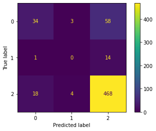

# Brands and Product Emotions

## Overview

Through this project, We will build an NLP model to analyze Twitter sentiment about Apple and Google products, the model can rate the sentiment of a Tweet based on its content. create a predictive classification model that makes it possible to understand the business problem, solve it and report the findings of the final model, including. predictions and performance metrics.

## Business Understanding

Millions of people share their opinions about various topics on Twitter daily, So Baghdad cell company makes Twitter one of the resources for their businesses and conducts a sentiment analysis of tweets from the SXSW Conference. The goal of this project is to develop a model that will classify tweets based on their sentiment either if it was negative, positive, or neutral on Apple products, the company is interested in selling Apple products and trying to design some advertisements for the products based on the positive tweets.

## Data Understanding

This project uses Brands and Product Emotions dataset from CrowdFlower via data. world Which consists of information about customer raters rated the sentiment in 9,093 Tweets. The tweets reflect which emotion they convey and what product/service/company this emotion is directed at based on the content.

## Modeling
Natural Language Processing (NLP) is a process of manipulating or understanding text or speech by any software or machine. An analogy is that humans interact and understand each other’s views and respond with the appropriate answer. In NLP, this interaction, understanding, and response are made by a computer instead of a human.

NLTK (Natural Language Toolkit) Library is a suite that contains libraries and programs for statistical language processing. It is one of the most powerful NLP libraries, which contains packages to make machines understand human language and reply to it with an appropriate response.(https://www.nltk.org/)

### Baseline Model:

Build a Baseline Model with TfidfVectorizer and MultinomialNB.

We will apply Multinomial Naive Bayes to NLP Problems. Naive Bayes Classifier Algorithm is a family of probabilistic algorithms based on applying Bayes’ theorem with the “naive” assumption of conditional independence between every pair of a feature. Bayes theorem calculates probability P(c|x) where c is the class of the possible outcomes and x is the given instance which has to be classified, representing some certain features.

P(c|x) = P(x|c) * P(c) / P(x).

Naive Bayes are mostly used in natural language processing (NLP) problems. Naive Bayes predict the tag of a text. They calculate the probability of each tag for a given text and then output the tag with the highest one.

Vectorization :
Vectorization is jargon for a classic approach of converting input data from its raw format (i.e. text ) into vectors of real numbers which is the format that ML models support. This approach has been there ever since computers were first built, it has worked wonderfully across various domains, and it’s now used in NLP.

### Final Model:Over sampling random forest with more features.
 .

The Random forest is a supervised Machine learning algorithm used for classification, regression. The Random forest classifier creates a set of decision trees from a randomly selected subset of the training set.

One approach to addressing the problem of class imbalance is to randomly resample the training dataset. The two main approaches to randomly resampling an imbalanced dataset are to delete examples from the majority class, called undersampling, and to duplicate examples from the minority class, called oversampling. Here we will use oversampling. Random resampling provides a naive technique for rebalancing the class distribution for an imbalanced dataset. Random oversampling duplicates examples from the minority class in the training dataset .

## Evaluation

We evaluated our final model based on the precision score metric as well as the F1 score, and the confusion matrix.

The best model based on performance and precision is the Oversampling random forest with more features., Acc=84% and precision = 87%

Precision — What percent of your predictions were correct?

Precision = TP/(TP + FP) High precision for class 2: Not many True values were predicted as False

Confusion Matrix gives a comparison between Actual and predicted values.

How to calculate FN, FP, TN, and TP for multi classes?

TP: The True positive value is where the actual value and predicted value are the same.

FN: The False-negative value for a class will be the sum of values of corresponding rows except for the TP value.

FP: The False-positive value for a class will be the sum of values of the corresponding column except for the TP value.

TN: The True Negative value for a class will be the sum of values of all columns and rows except the values of that class that we are calculating the values for.

Confusion Matrix allows us to measure the Recall, Precision, and Accuracy of the model.

## Conclusion and Recommendations

Twitter is one of the top platforms to keep up with the latest trends and conversations. People can use Twitter daily to follow their favorite brands and give their opinions about these brands. Through this project, We created a predictive classification model that makes it possible to understand the positive tweets about Apple products We indicate the three most important positive tweets on Apple products focus:

1-Marketing strategy: temporary pop-up store announcement in downtown Austin has been received very well by Apple fans, held events on these shops giving away some prizes of valuable Apple products, the company also should pay attention to providing their products online that would help more fans to buy these products easily and minimize the waiting line in front of stores.

2-Advanced technology: People talk about some technologies which getting better like tethering(the sharing of a mobile device's Internet connection with other connected computers), and fast delegating (app response) Apple Develops Holographic iPhone Screen (a picture of a "whole" object, showing it in three dimensions), downloading and updating the apps don't taking a long time.

3-The camera: Apple's camera uses a larger Wide sensor with bigger pixels to gather more light, for more detail and color in photos would provide a video stabilization performance and Advanced Features for photo & video.

## Next Steps

Further analyses could yield additional insights to further improve the model performance.

## For more information

Email :mays802004@ gmail.com 
GitHub :maysasaad

## Repository Structure

├── data
├── images 
├── README.md 
├── Presentation.pdf 
└── Jupyter notebook.ipynb
